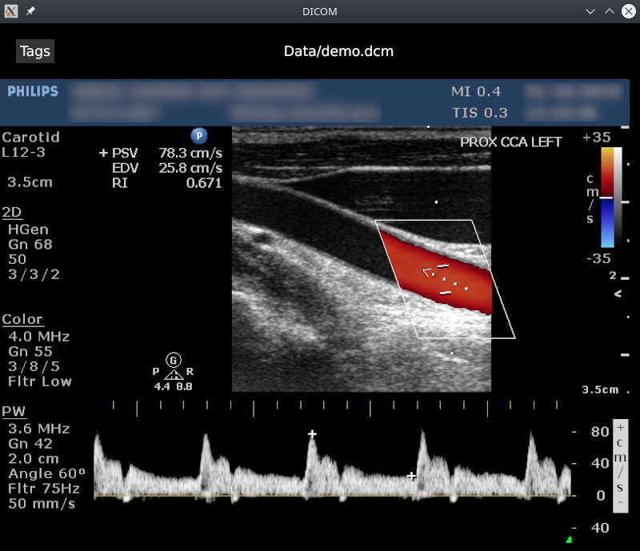
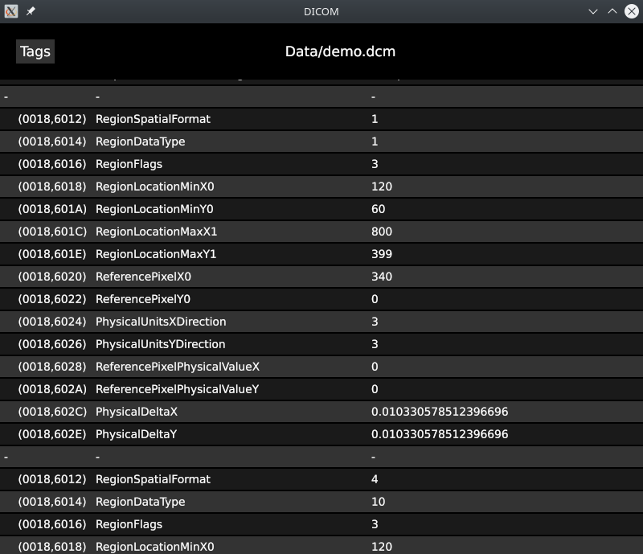

# OxyDICOM

A simple 2D DICOM viewer written in Rust, using [dicom-rs](https://github.com/Enet4/dicom-rs) for parsing DICOM tags and [iced](https://github.com/hecrj/iced) for the UI.

This program was made as a learning project and is only a best-effort implementation of the DICOM standard. The following transfer syntaxes are supported:

* `1.2.840.10008.1.2.1` Explicit VR Little Endian
* `1.2.840.10008.1.2.4.50` JPEG Baseline (Process 1)
* `1.2.840.10008.1.2.4.90` JPEG 2000 (Lossless)
* `1.2.840.10008.1.2.5` RLE

Palette mapping with the photometric interpretation `PALETTE COLOR` is supported.





## Building

```
cargo build --release
```

Will build 3 binaries:
* `target/release/oxydicom`: the main program
* `target/release/dicom2png`: an utility tool to convert DICOM files to PNG
* `target/release/benchmark`: a benchmark utility to measure the performance of DICOM decoding on a folder of images.

## Usage

```
oxydicom <path to DICOM>
```
